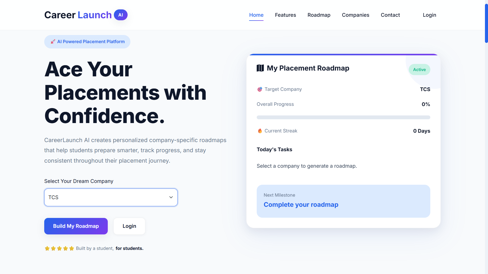
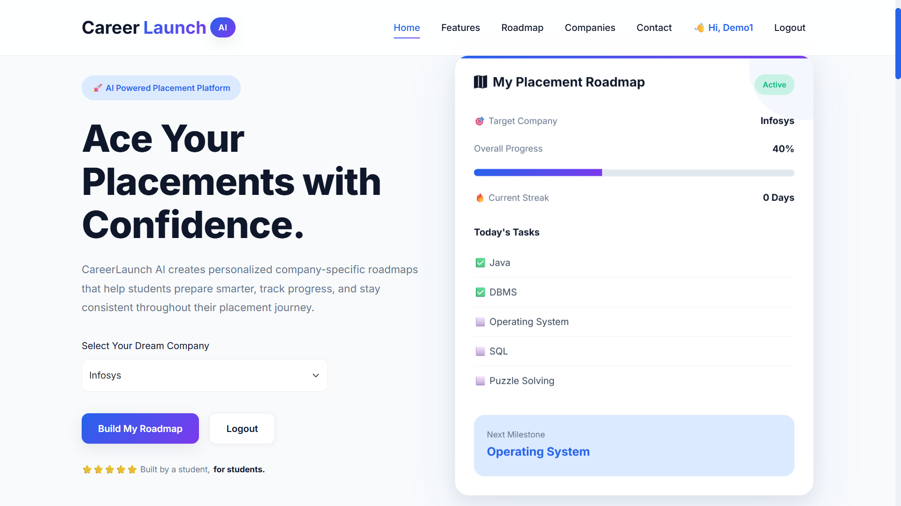
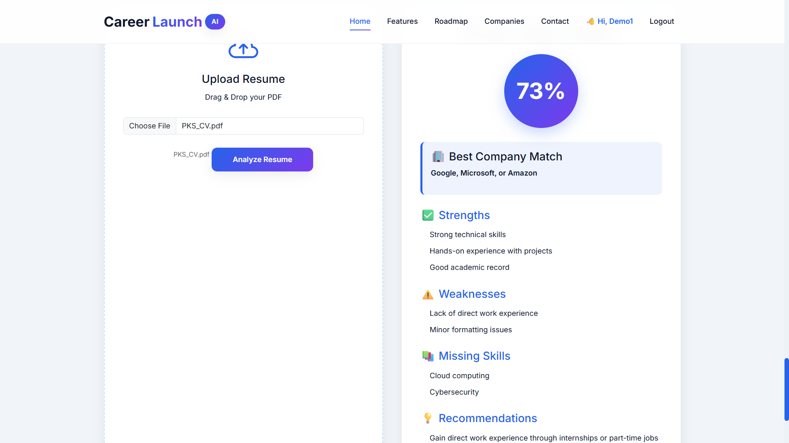

<p align="center">


</p>

<h1 align="center">🚀 CareerLaunch AI</h1>

<p align="center">
AI-powered Career Guidance Platform for Placement Preparation
</p>

AI-powered Career Guidance Platform that helps students prepare for placements through personalized company roadmaps and AI-driven ATS Resume Analysis.

---

## 🌐 Live Demo

👉 https://career-launch-ai-two.vercel.app/

## 💻 Backend API

👉 https://careerlaunch-ai-backend.onrender.com/

---

## ✨ Features

- 🔐 JWT Authentication
- 👤 User Registration & Login
- 📄 AI Resume Analyzer
- 🤖 Groq AI Integration
- 📊 Dynamic ATS Score
- 🎯 Personalized Company Roadmaps
- ✅ Progress Tracking
- 📈 Interactive Dashboard
- ☁️ MongoDB Atlas
- 🌍 Fully Deployed

# 🛠 Tech Stack

## Frontend

- HTML5
- CSS3
- JavaScript

## Backend

- Node.js
- Express.js

## Database

- MongoDB Atlas

## Authentication

- JWT
- bcrypt

## AI

- Groq API
- Llama 3.3 70B

## Deployment

- Vercel
- Render

  # 📂 Project Structure

```text
CareerLaunch-AI
│
├── 📁 assets/                      # GitHub README assets
│   ├── landing.png
│   ├── dashboard.png
│   ├── login.png
│   ├── register.png
│   ├── resume-analyzer.png
│   ├── roadmap.png
│   └── architecture.png
│
├── 📁 client/                      # Frontend
│   ├── 📁 css/
│   │   ├── 📁 base/
│   │   ├── 📁 components/
│   │   ├── 📁 utilities/
│   │   ├── login.css
│   │   └── style.css
│   │
│   ├── 📁 images/
│   ├── 📁 js/
│   ├── 📁 pages/
│   └── index.html
│
├── 📁 server/                      # Backend
│   ├── 📁 config/
│   ├── 📁 controllers/
│   ├── 📁 data/
│   ├── 📁 middlewares/
│   ├── 📁 models/
│   ├── 📁 routes/
│   ├── 📁 services/
│   ├── 📁 utils/
│   └── server.js
│
├── .gitignore
├── LICENSE
├── package.json
├── package-lock.json
└── README.md
```

# 📸 Screenshots

## Landing Page



---

## Dashboard



---

## Resume Analyzer



# ⚙️ Installation

Clone the repository

```bash
git clone https://github.com/The-Rajput-PS/CareerLaunch-AI.git
```

Go inside

```bash
cd CareerLaunch-AI
```

Install dependencies

```bash
npm install
```

Run Backend

```bash
cd server

npm install

node server.js
```

Run Frontend

Open

client/index.html

using Live Server.

# 🔑 Environment Variables

Create a .env file inside server

```env
PORT=

MONGODB_URI=

JWT_SECRET=

GROQ_API_KEY=
```

# ⚙️ Workflow

User

↓

Register/Login

↓

JWT Authentication

↓

Choose Company

↓

Generate Roadmap

↓

Save Progress

↓

Upload Resume

↓

Groq AI

↓

ATS Analysis

# 🚀 Future Improvements

- More company roadmaps
- Resume templates
- AI career recommendations
- Email verification
- Analytics dashboard

# 👨‍💻 Author

Prasoon Kumar Singh

GitHub

https://github.com/The-Rajput-PS

LinkedIn

https://www.linkedin.com/in/prasoon-kumar-singh/
